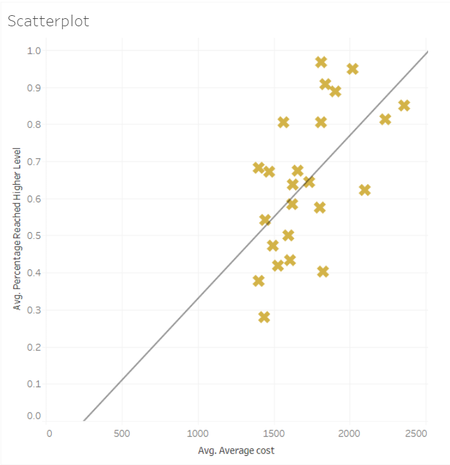
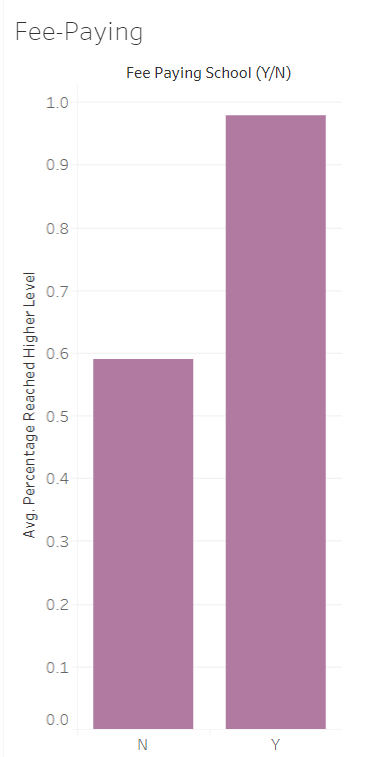
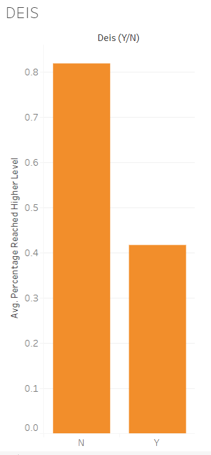
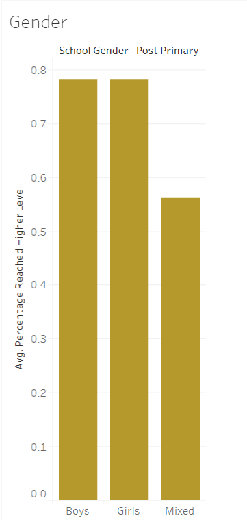

# Wealth-Disparity-and-Access-to-Third-Level

[Link to this webpage.](https://aoifehoran97.github.io/Wealth-Disparity-and-Access-to-Third-Level/)

<h1>The more expensive a place is to rent in Dublin the more likely a teen in the area will progress to third level, new research reveals/<h1>
  
 <strong> Here is the interactive map with the Average Rent Prices, Average Third-Level Progression Rates and Second-Level School locations in Dublin.</strong>

<iframe src="https://www.google.com/maps/d/u/0/embed?mid=11Z7C4pZofy8x8XIXdGq5rym34vl6tTBZ" width="640" height="480"></iframe>

Scatterplot Screenshot:

<h4>NEW research has shown that the more expensive a place is to rent, the higher the rates of third level progression were in 2016. 
</h4>

Those living in Dublin 14, in areas such as Rathfarnam and Dundrum, lucked out with the highest rates of progression to third level among Leaving Certificate Students at 97 per cent with average rental costs nearly €600 below the most expensive areas.

Those renting in Dublin 2 see the highest rental prices, averaging at around €2,358.6 per month but still have a majority success at third level progression with 85 per cent of those educated in the area accepting offers in third level institutions.

Other areas with a high third level progression rate and rental price include predominantly Southside areas such as Dublin 6, Dublin 6 West, Dublin 4, Dublin 18 and Dublin 20.

The worst contending postal area for third level progression is Dublin 17, which includes areas such as Darndale, Coolock, Priorswood and part of Santry. 

This area has a rental price of €1,437 but an average progression to third level of only 28%, it is however, important to note that there is only one second level institution in this area, Colaiste Dhulaigh, and the majority of young people in the area are educated in the surrounding areas. 

When assessed the data has a correlation of 0.59, with the highest being 1 and the lowest being -1, this definitely shows that there is a strong correlation between higher rental prices and academic success in the Dublin region.

FeePaying Barchart Screenshot:

DEIS School Barchart Screenshot:

The data also shows that those attending Fee paying schools in Dublin in 2016 had nearly double the chance of progressing to third level, with an astounding 98 percent of those in Fee Paying schools accessing third level as opposed to just 58 percent of those in non fee paying schools.

Furthermore, this disparity can be seen in the difference between students in DEIS schools versus those in non DEIS schools, DEIS being a government scheme standing for Delivering Equality of Opportunity in School to help educational facilities for young people in disadvantaged areas. 

Those in non DEIS schools had almost double the chance of progressing to third leven than those in DEIS schools, with just a 42% progression for those in DEIS schools in 2016.

The DEIS scheme was launched by the government in 2005, 11 years before this data was accumulated.

One other interesting point to note is that those in mixed schools underperformed those in single gendered schools by over a quarter and there is only a .15 percent difference between boy only schools and girl only schools, with female only schools taking the lead.

This new research was accumulated by using The Daft final report of 2016 and comparing it with  The Irish Times Third level progression list and data.gov’s data on all schools to find relevant information and addresses combined.

[Link to Tableau Data](https://public.tableau.com/views/TLPRate/Scatterplot?:embed=y&:display_count=yes&:origin=viz_share_link)

Gendered Schools Barchart Screenshot:

